# Dreo Cloudcutter
A hacking adventure... 🧝💻🔓

# Disclaimer

This information is provided for educational purposes only, I'm not responsible if you break, or brick your equipment following some instructions provided herein (see [License](LICENSE)). It is very likely that you will do so, and at the very least you should be prepared to connect via UART to your device.

# Thanks

This project wouldn't have been possible without the invaluable help of other community members, namely [Gabriel Tremblay](https://github.com/gabtremblay) for helping me with the firmware extraction part and [kuba2k2](https://github.com/kuba2k2) for his incredible work on [Libretiny](https://docs.libretiny.eu/) and inifinite knowledge & patience that unblocked me multiple times. Also, shoutout to my local *Robot Speakeasy* maker community for their support and sharing multiple ideas along the way! 

Obviously, this took a fair bit of my free time, so thanks to my loved ones ❤️ for their support as I was spending an inordinate amount of energy on that project...

# Intro

Summers are getting [pretty hot](https://en.wikipedia.org/wiki/Climate_change), and with an unfortunate AC failure I had to find quick alternatives such as quality fans to stay cool while the AC was getting repaired. 

I thus turned to the Internet to find some reviews & benchmarks, and after a watch of this [video](https://www.youtube.com/watch?v=k0e7vdphUi8) by TEKDAD (who by random occurence is another Montrealer ), I was convinced to go with a [Dreo Pilot Max S](https://www.amazon.com/Dreo-Oscillating-Bladeless-Bedroom-Standing/dp/B09M8PMW26/) specific model **DR-HTF004S**.

Let's be honest, it doesn't look as good as the Dysons, but it's much, much cheaper AND more performant & silent at almost any power. Oh, and it also has wifi/mobile remote control abilities, woah!

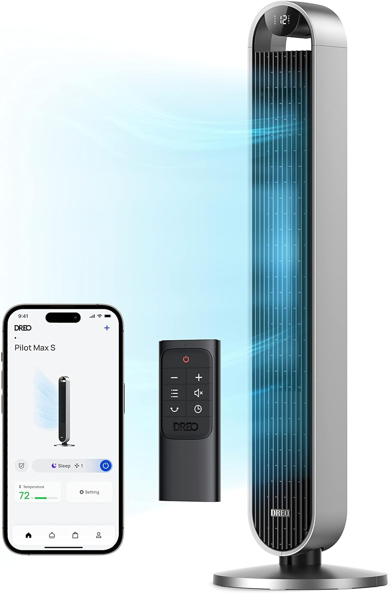

Little did I know, this was the start of a great adventure... 🧝🗡️🏹

# Table of contents

<!-- TOC -->

- [Dreo Cloudcutter](#dreo-cloudcutter)
- [Disclaimer](#disclaimer)
- [Thanks](#thanks)
- [Intro](#intro)
- [Table of contents](#table-of-contents)
    - [Intro](#intro)
    - [The Current Integrations](#the-current-integrations)
    - [The Android Apps](#the-android-apps)
    - [The protocols](#the-protocols)
    - [The spurrious Webserver](#the-spurrious-webserver)
    - [De-clamshelling that "Monster"](#de-clamshelling-that-monster)
    - [The Internals](#the-internals)
    - [The Tuya dead end...](#the-tuya-dead-end)
    - [The "Wifilist" dead end...](#the-wifilist-dead-end)
    - [Dumping that firmware](#dumping-that-firmware)
    - [Reversing the Webserver](#reversing-the-webserver)
    - [The Webserver endpoints](#the-webserver-endpoints)
    - [Flashing ESPHome](#flashing-esphome)
        - [Finding the keys](#finding-the-keys)
        - [Finding the partition offsets](#finding-the-partition-offsets)
    - [Reversing the UART Protocol](#reversing-the-uart-protocol)
        - [Change Fan Settings Byte Map](#change-fan-settings-byte-map)
        - [Checksum](#checksum)
    - [Putting this all together](#putting-this-all-together)
- [The Howto](#the-howto)
    - [Create your ESPHome environment](#create-your-esphome-environment)
    - [Get the Dreo YAML file](#get-the-dreo-yaml-file)
    - [Build the image](#build-the-image)
    - [Upload your OTA Update](#upload-your-ota-update)
- [Where do we go from here / What's left to tackle](#where-do-we-go-from-here--whats-left-to-tackle)
- [FAQ](#faq)
    - [When is XXXXX going to be supported?](#when-is-xxxxx-going-to-be-supported)
    - [It doesn't work on my fan / I Bricked it / etc.](#it-doesnt-work-on-my-fan--i-bricked-it--etc)
    - [Does this work with other Dreo Pilot Max DBTF04S, DTTF04S?](#does-this-work-with-other-dreo-pilot-max-dbtf04s-dttf04s)
    - [Are you going to maintain that ESPHome module?](#are-you-going-to-maintain-that-esphome-module)
    - [Why didn't you implement MQTTS support for the control of the device?](#why-didnt-you-implement-mqtts-support-for-the-control-of-the-device)

<!-- /TOC -->

You can directly skip to the [Howto](#the-howto) if you don't care for this.

## Intro
Gather round boys and girls, we're going on an adventure! 🚌🌈

Like a lot of folks, I'm not a super fan (hah, that'll be the *Only Fan* pun, I promise) of IoT devices that are cloud-dependent. Past experiments have shown such cloud services get [inevitably shut down](https://twitter.com/doctorow/status/1516144514984923139) or get enshitified for profitability reasons. It is also common knowledge that the "S" in IoT stands for Security: I'd rather have these devices isolated, and when possible, controlled locally without any dependency on the cloud.

## The Current Integrations

I was thus quite happy to see that there existed an [alternative for Dreo fans](https://github.com/JeffSteinbok/hass-dreo) to control them via Home Assistant, thanks to the hard work by [Jeff Steinbok](https://github.com/JeffSteinbok). This integration is based on the work by [Gavin Zyonse](https://github.com/zyonse) for on the [Dreo Homebridge integration](https://github.com/zyonse/homebridge-dreo).

These are great, I don't need the basic and upsell-ridden Dreo app, but wait a minute... These still depend on the cloud!😩

There must be another way, the community seemed content with that "alternative interface" to the Dreo app, but not me, I wanted local access.

Speaking from a security background, there were plenty of ways I could tackle that challenge:

- Maybe I can MiTM the connection between the device and the cloud to reverse it?
- Maybe I can reverse the Android App and find the protocol it's using for local control?
- Maybe I can find something exposed by the device on the network that I can leverage directly?
- Maybe via BLE I'd be able to do this direclty as well?
- Maybe I can open it and add an ESP8266 in it to do the work?
- etc.

## The Android App(s)

My first attention came to the Android app, I downloaded the APK, loaded it in [JADx](https://github.com/skylot/jadx) and dumped it in APKTool() (The more different approaches, the better I guess) and started grepping/searching for strings, trying to comprehend what was happening when the App was registering the device, controlling the device, and removing the device.

Of course, some of that work had already been done by [the current integrations](#the-current-integrations) and thus I was able to have somewhat of a reference when looking at that gigantic dump of Smali files.

Maybe there was direct communication with the device that I could find, and an exposed endpoint that I could query, or a firmware bundled in the app that I could take a look at?

I immediately tried to look for Web endpoints, and ended up in the `com.airone.hsbase.constant.RequestConfig` Class that contains a LOT of interesting info:

- Most, if not all, the Web endpoints.
- Two distinct client secrets (what are these used for?).
- The hosts the app connects to, including non-production hosts.
- References to other pieces of code.

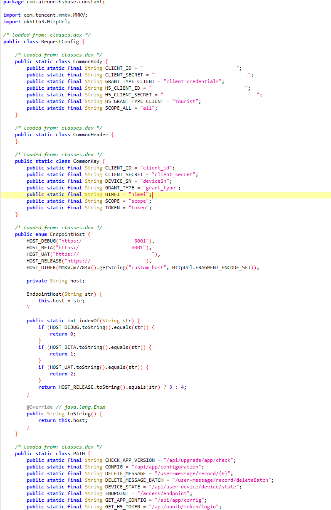

This looks promising, let's dig further... Looking for something related to the firmware, or a side protocol, using grepping the Apktool outpout and searching with JADX.

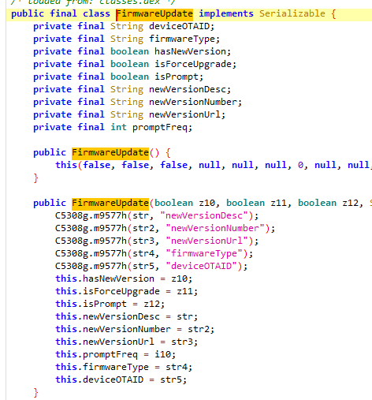

Ok so there clearly is some mechanism to handle firmware OTA updates in collaboration with the App... Maybe I can grab one to take a look at?

I didn't see an endpoint for that in the previous file, maybe it's hidden somewhere?

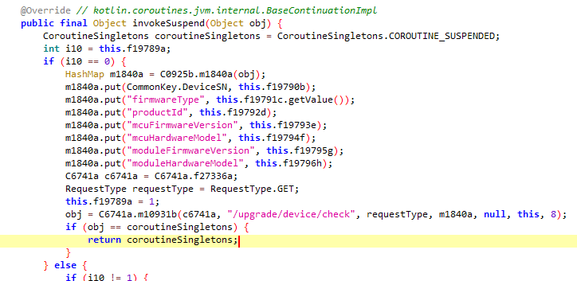

There it is!

**But what does it do?**

Well, let's figure out what is being sent to that endpoint, using ADB debugger and letting the app do its thing:

```html
https://app-api-us.dreo-cloud.com/api/upgrade/device/check?moduleFirmwareVersion=1.2.52&firmwareType=mcu&mcuFirmwareVersion=0.0.3&moduleHardwareModel=PAI-051&productId=<PRODUCT_ID>&mcuHardwareModel=midea&devicesn=<SERIAL>&timestamp=<TIMESTAMP>
```

So we know it sends:

```bash
moduleFirmwareVersion=1.2.52 # (and from online info we can find that 1.2.17 is also a valid value)
firmwareType=mcu
mcuFirmwareVersion=0.0.3
moduleHardwareModel=PAI-051 # This will be useful later
```

Can we get an update link by sending an older version?

Let's craft a valid response, using what we know so far (and yes, we need to have the correct timestamp to get it):

```bash
A=`python3 -c "import time;print(str(int(time.time() * 1000)))"`;curl -vvvvk "https://app-api-us.dreo-cloud.com/api/upgrade/device/check?moduleFirmwareVersion=<OLDER_VERSION>&firmwareType=module&mcuFirmwareVersion=<FIRMWARE_VERSION>&moduleHardwareModel=PAI-051&productId=<VALID_PRODUCT_ID>&mcuHardwareModel=midea&devicesn=<VALID_DEVICE_SN>&timestamp=$A" --user-agent 'dreo/2.5.12' -H 'Authorization: Bearer <BEARER_TOKEN>' -H 'ua: dreo/2.5.12 (sdk_gphone64_arm64;android 13;Scale/2.625)'
```

We get this:
```JSON
{"code":0,"msg":"OK","data":{"hasNewVersion":true,"newVersionNumber":"1.2.29","firmwareType":"module","newVersionDesc":"Performance improvements and bug fixes.","deviceOTAID":"<SOME_OTA_ID>","isPrompt":false,"promptFreq":null,"isForceUpgrade":false}}
```

So unfortunately it provides only an OTA ID, not a full URL, and at this stage it's not clear what do do with it. Let's keep this on the side for now, as updates must also be delivered in some other way.

Allright so the Android app might be a bit of a dead end, but let's look at the protocols.

## The protocol(s)

Doing a bit of *tcpdumping* it seems the app uses mqtts and https to talk to the backend server, hosted on [AWS Core IoT](https://aws.amazon.com/iot-core/):

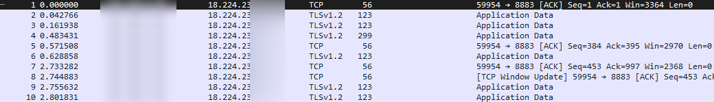

So no luck there, but maybe if I block the MQTTs it'll fall back to MQTT? No it didn't :

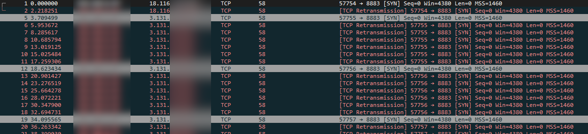

Maybe during the initial handshake/device registration, there's info that is sent in the clear?

Nope, it's all done over HTTPS:
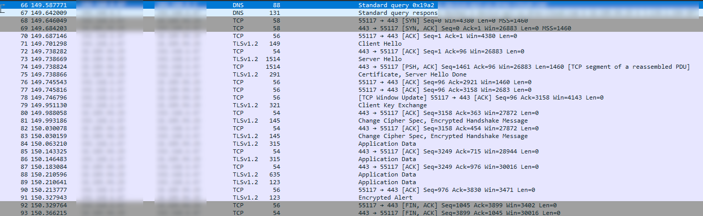

Ok so maybe if I just grab the app cert and try to MiTM using [MiTMProxy+SSLStrip](https://github.com/mitmproxy/mitmproxy/blob/main/examples/contrib/sslstrip.py) or [SSLSplit](https://github.com/droe/sslsplit), or even with a specialized MQTT Proxy like [IOXY](https://github.com/NVISOsecurity/IOXY)?

After much fiddling setting these up, following online guides like [this one](https://www.markloveless.net/blog/2020/7/7/my-mitmsniffing-station) and fighting a lot with `Iptables`, I wasn't able to accomplish much, and somewhat concluded that there must be some cert pinning on the device itself...

Well, what a disappointment... Turns out there can be an `S` in `IoT` sometimes?

Maybe if we take a closer look at the device, we'll find some things we can rely on?

Well let's use the best security tool out there, the one that so many commercial products rely on, our good old `nmap`:

```console
Starting Nmap 7.80 ( https://nmap.org ) at 2024-07-19 10:38 EDT
Nmap scan report for wlan0 (192.168.6.47)
Host is up (0.0040s latency).
Not shown: 998 closed ports
PORT   STATE SERVICE VERSION
53/tcp open  domain  dnsmasq 2.86
| dns-nsid:
|_  bind.version: dnsmasq-2.86
80/tcp open  http
| fingerprint-strings:
|   DNSStatusRequestTCP, DNSVersionBindReqTCP, FourOhFourRequest, GenericLines, GetRequest, HTTPOptions, Help, Kerberos, RPCCheck, RTSPRequest, SMBProgNeg, SSLSessionReq, TLSSessionReq, TerminalServerCookie, X11Probe:
|     HTTP/1.0 404 Not Find
|     Content-Type: text/plain
|     Connection: close
|_    Content-Length: 0
```

Oh, so there's a `dnsmasq` server (unfortunately not vulnerable to anything exploitable, really), and there's a Webserver that isn't readily identifiable... Interesting 🤔

Are there anything else open in higher ports?
```console
$sudo nmap -sS -p- -Pn 192.168.6.47
Starting Nmap 7.80 ( https://nmap.org ) at 2024-07-19 10:43 EDT
Stats: 0:00:48 elapsed; 0 hosts completed (1 up), 1 undergoing SYN Stealth Scan
SYN Stealth Scan Timing: About 90.16% done; ETC: 10:44 (0:00:05 remaining)
Nmap scan report for wlan0 (192.168.6.47)
Host is up (0.0057s latency).
Not shown: 65533 closed ports
PORT   STATE SERVICE
53/tcp open  domain
80/tcp open  http

Nmap done: 1 IP address (1 host up) scanned in 54.12 seconds
```
No luck, only these two services... 😩

Now, at that time many other scans were done, before, during, after the initial setup/handshake, many different parameters & types of scans were executed, but nothing of value came out.

Allright then, I guess, before resorting to "harder" methods, let's focus on that Webserver...

## The spurrious Webserver

So, what's up with that Webserver, surely we can find some exposed endpoints, maybe there's an easy way to update hidden somewhere?

Let's curl a few test pages to see (tried `index`, `index.html`, etc.)

```console
$curl -vvvvk http://192.168.6.47/index.html
*   Trying 192.168.6.47:80...
* Connected to 192.168.6.47 (192.168.6.47) port 80 (#0)
> GET /test HTTP/1.1
> Host: 192.168.6.47
> User-Agent: curl/7.81.0
> Accept: */*
>
* Mark bundle as not supporting multiuse
* HTTP 1.0, assume close after body
< HTTP/1.0 404 Not Find
< Content-Type: text/plain
< Connection: close
< Content-Length: 0
<
* Closing connection 0
```

Well that's not interesting, but wait, there's an english mistake in there "404 Not Find", maybe we can find some reference online and that'll guide us towards knowing what kind of Webserver that is, and maybe its endpoints...
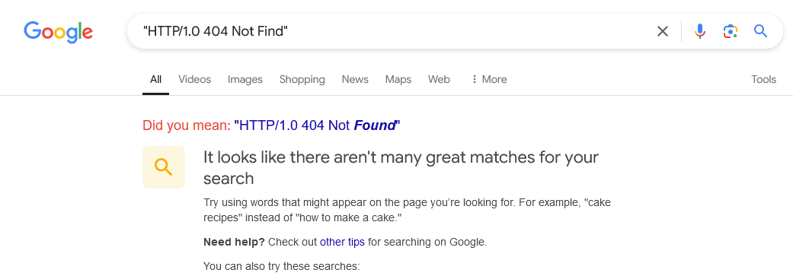

Oh noes!

Allright then, let's get the bigger guns out, we need to fuzz that Webserver to find potential pages/endpoints, starting with Tachyon:

```console
$tachyon --concurrency 0 http://192.168.6.47 -a -l 5 -m 5 -r -u "website/2.0.0" --har-output-dir .

         Tachyon v3.5.3 - Fast Multi-Threaded Web Discovery Tool
         https://github.com/delvelabs/tachyon

[11:01:16] [INFO] Starting Discovery on http://192.168.6.47
[11:01:16] [INFO] Loading target paths
[11:01:16] [INFO] Loading target files
[11:01:16] [INFO] Supplied cookie file not found, will use server provided cookies
[11:01:16] [INFO] Fetching session cookie
[11:01:16] [INFO] Request for website root failed.
[11:01:16] [INFO] Executing 5 host plugins
[11:01:16] [INFO]  - Robots Plugin: /robots.txt not found on target site
[11:01:16] [INFO]  - SitemapXML Plugin: /sitemap.xml not found on target site
[11:01:16] [INFO]  - PathGenerator Plugin: added 75 computer generated path.
[11:01:16] [INFO]  - PathGenerator Plugin: added 36 computer generated files.
[11:01:16] [INFO]  - HostProcessor Plugin: added 7 new filenames
[11:01:16] [INFO]  - Svn Plugin: Searching for /.svn/entries
[11:01:16] [INFO]  - Svn Plugin: no /.svn/entries found
[11:01:16] [INFO] Generating file targets for target root
[11:01:16] [INFO] Probing 6605 files
[11:03:26] [INFO] Probing 343 paths
[11:03:32] [INFO] Found 0 valid paths
[11:03:32] [INFO] Generating file targets
[11:03:32] [INFO] Probing 0 files
[11:03:32] [ERROR] Re-validation aborted. Target no longer appears to be up.
[11:03:32] [INFO] Scan completed
[11:03:32] [INFO] Statistics: Requested: 6953; Completed: 6953; Duration: 136 s; Retries: 3; Request rate: 50.98
```

Note that I tried a few `User-Agent` strings inspired by the Android App, thinking that maybe there was a filter in the code for some of that, but it didn't change the results.

So, no luck there, maybe something more recent like FeroxBuster ?

```console
 $./feroxbuster --url http://192.168.6.47 --rate-limit 1

 ___  ___  __   __     __      __         __   ___
|__  |__  |__) |__) | /  `    /  \ \_/ | |  \ |__
|    |___ |  \ |  \ | \__,    \__/ / \ | |__/ |___
by Ben "epi" Risher 🤓                 ver: 2.10.4
───────────────────────────┬──────────────────────
 🎯  Target Url            │ http://192.168.6.47
 🚀  Threads               │ 50
 📖  Wordlist              │ /usr/share/seclists/Discovery/Web-Content/raft-medium-directories.txt
 👌  Status Codes          │ All Status Codes!
 💥  Timeout (secs)        │ 7
 🦡  User-Agent            │ feroxbuster/2.10.4
 🔎  Extract Links         │ true
 🏁  HTTP methods          │ [GET]
 🔃  Recursion Depth       │ 4
 🚧  Requests per Second   │ 1
───────────────────────────┴──────────────────────
 🏁  Press [ENTER] to use the Scan Management Menu™
──────────────────────────────────────────────────
404      GET        0l        0w        0c Auto-filtering found 404-like response and created new filter; toggle off with --dont-filter
[>-------------------] - 6m       374/30000   8h      found:0       errors:0

(... a long time later, it didn't find anything)
```

Well shoot... 😢 We could also try a few other tools like [httpfuzz](https://github.com/JonCooperWorks/httpfuzz) for good measure, but it won't give us much more...

Also, the Webserver is incredibly weak and crashes quite easily, which makes sense as it must be a very small device. For instance, to `nmap` it properly, we need to use the `-sF` scan, since to be faster, `nmap` sends `RST` packets before `FIN` and this would cause an instant crash of the Webserver.

Funny last comment, the HTTP response is so unique that it's pretty easy to identify other similar equipment running exposed on the Internet (although there aren't a lot of these):
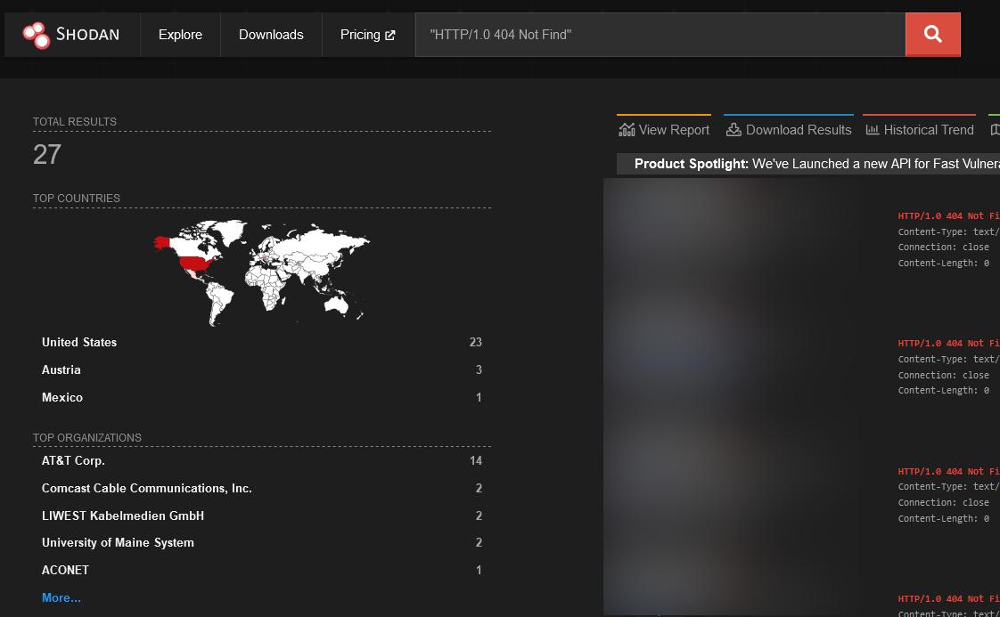

At this stage, we're apparently out of luck on the software side (some apparence of security in an IoT device? Shocking!), we have to go deeper, let's get down to the hardware level... 

## De-clamshelling that "Monster"

Images & instructions to come...

TL;DR; Repairability Score:<br>


## The Internals

Upon close inspection, we can see that outside of the power circuit in the base of the fan, the internals consist of three boards:

- A screen display management board.
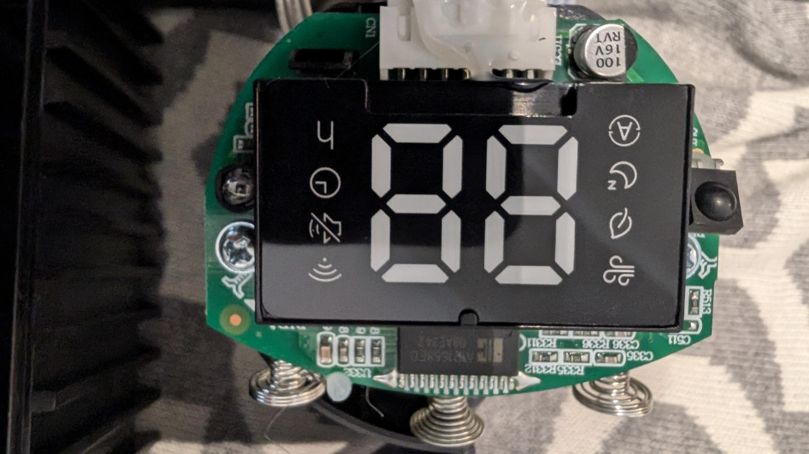

- A control board.
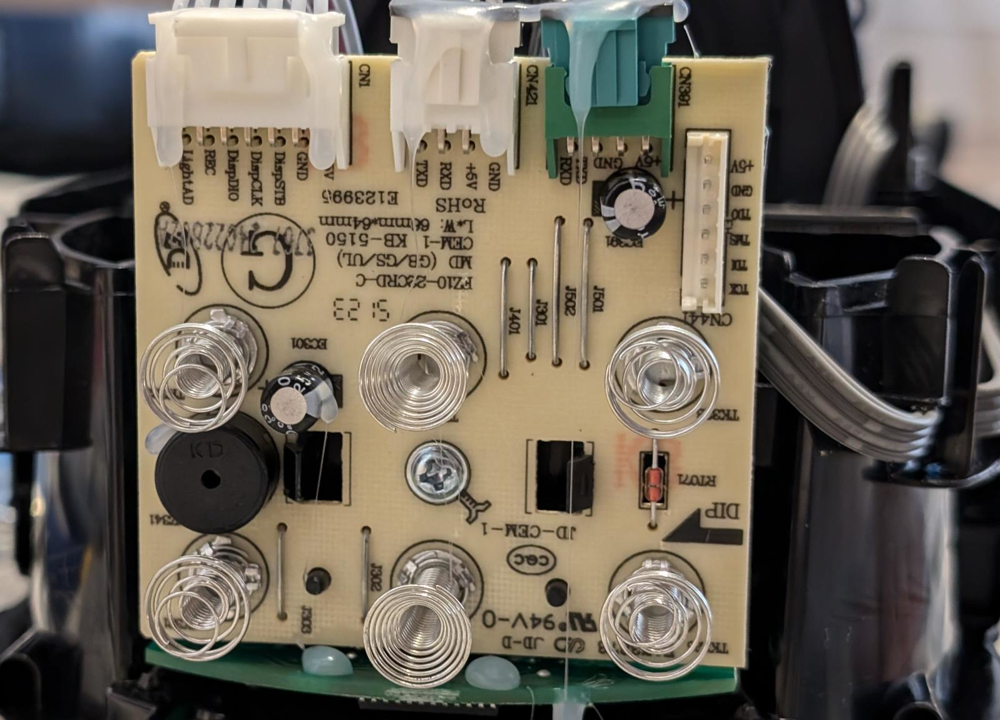

- A wireless/IoT board.
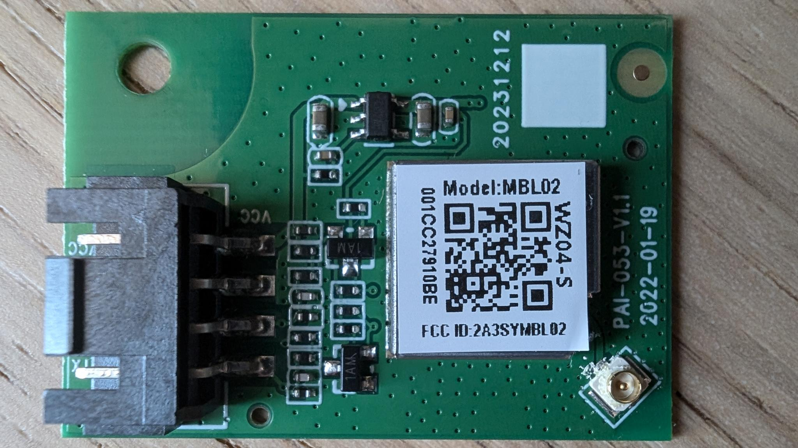

Of obvious interest to us is the wireless board, that is connected to the button/control board via what looks very much like a UART cable.

On the other side of the button/control board is its main chip, an SH79F9463P from Sino Wealth. I wasn't able to find the exact spec sheet, but I found something closely related for the [SH79F9476](https://hr.sinowealth.com:8086/pre/json_go/file_xz?tool_id=1139&type=2) from [here](https://en.sinowealth.com/article?new_id=2142).

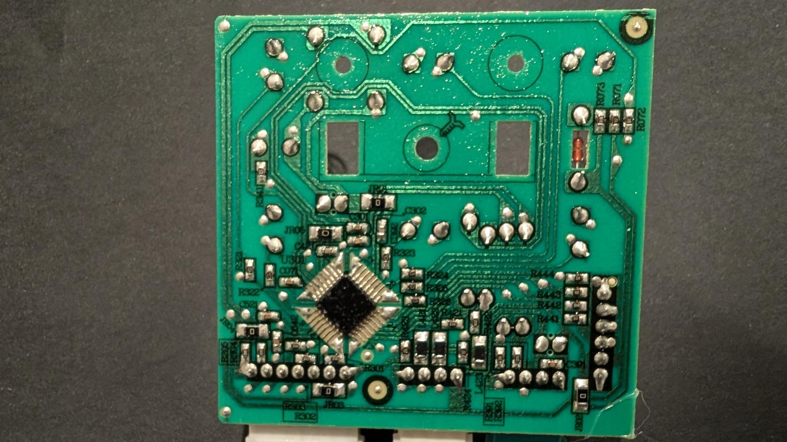
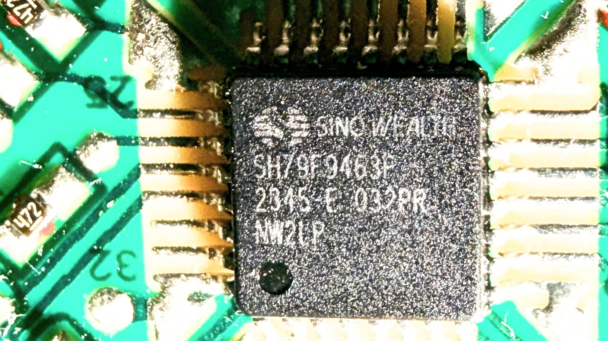

Ok so this is a 8051 MCU, probably in charge for controlling the fan rotation/speed since the fan works without the wireless/IoT board connected, and it speaks to the wireless/IoT board via UART, almost guaranteed. 

Let's turn our attention to the IoT board for a minute:

**PAI-053**, we can remember that from somewhere, but it was PAI-051 then... Are there any hits online?
Well, there's an FCC-ID on the board [2A3SYMBL02](https://fcc.report/FCC-ID/2A3SYMBL02)

And would you look at that, a [full spec sheet with diagrams and all](https://fcc.report/FCC-ID/2A3SYMBL02/5746150), now we're talking.

We can we learn from this?
- We can confirm this is the righ device since the FCC cert was made for Hesung Innovation Limited, the real name behind the Dreo brand.
- We can confirm the PCB was made by either "Power7 Technology" or "i4 season".
- It runs a BL2028N chip, powered by 3.3v - https://fcc.report/FCC-ID/2A3SYMBL02/6883436

After much, much googling I was able to find https://www.i4season.com/#/homepage which mid-page lists this exact board for sale, with the same name (and here are the PAI-051 vs PAI-053 differences).
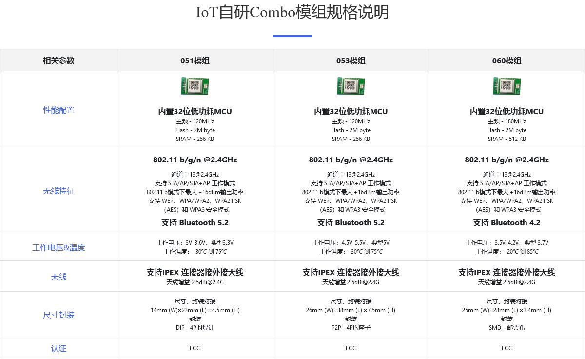

Now that we know what chip this should be, let's validate it, and gather more information on it. First, let's apply a bit of a heat gun to the shield:

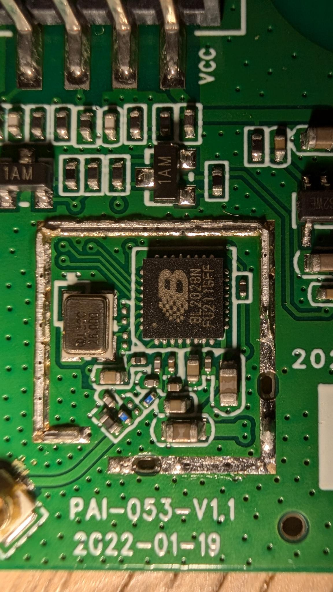

Clearly a BL2028N - After much reading on the chip, they're actually a special kind of [BK72xx](https://www.bekencorp.com/en/goods/detail/cid/7.html) (Mostly BK7231M), by Beken, and are well known from the open source community. The datasheet for that chip is on the [Elektroda forums](https://www.elektroda.com/rtvforum/topic3951016.html) (end of post attachment).

Two open source projects actually support these chips:

- [OpenBeken](https://github.com/openshwprojects/OpenBK7231T_App).
- [Libretiny](https://docs.libretiny.eu/), now ported to [ESPhome](https://esphome.io/components/libretiny.html).

So this is great news, I might have a way to flash these with open source software, and then control the device via HA without the cloud! 🎉

But wait, even if I flash these, how do I control the fan if it's actually the 8051 MCU that does the job? How do the two talk to eachother?

I really need to dump that firmware to get to the next level, thankfully both of these communities have a set of tools, and even Beken makes some available on their download page.

- OpenBeken's [BK7231GUIFlashTool](https://github.com/openshwprojects/BK7231GUIFlashTool)
- Libretiny Flasher [ltchiptool](https://github.com/libretiny-eu/ltchiptool)
- Beken [toolset](https://dl.bekencorp.com/tools/flash/) [here](https://dl.bekencorp.com/tools/Security) and [here](https://dl.bekencorp.com/tools/toolchain) (but doesn't work reliably all the time).

Reading on these projects, it seem that they grew out of the ubiquiteousness of [Tuya](https://www.tuya.com/) devices and the desire to take back control on these.

## The Tuya dead end...

OK so, maybe that's just it: this is a Tuya device and we can flash it like all the others. This would be awesome since opening that darn clamshell was really hell: it would be best that others wanting to *decloudify* their Dreo fans not have to go through this!

Reading through [Beken's](https://docs.bekencorp.com/backup/v3.0/get-started/overview.html) [doc](https://docs.bekencorp.com/armino/bk7256/en/latest/) it would seem that these devices run FreeRTOS with options for customization, like Tuya, or AliOS, or some custom applicative layer.

Good news is Tuya has a relatively easy to run exploit for a [very well documented vulnerability](https://rb9.nl/posts/2022-03-29-light-jailbreaking-exploiting-tuya-iot-devices/), and leveraged as part of the [tuyaTuya Cloudcutter toolset](https://github.com/tuya-cloudcutter/tuya-cloudcutter).

The exploit relies on putting the device in "wifi handshake/fallback" mode, which I thought I could do and see a generic `Dreo<hex>` AP, connect to it and send the right payload... But on what port? There's no `UDP/6669` port exposed on my device at any point in time (and it doesn't really appear after 6-fast-poweron-cycles).

A few options and ports with the [PoC][(https://github.com/tuya-cloudcutter/tuya-cloudcutter/blob/main/proof-of-concept/poc.py) were tested, but to no avail, we're clearly not facing a Tuya device...

This means we'll have to work harder 💪

## The "Wifilist" dead end...

While waiting for better hardware to dump the chip via UART (or SPI), I continued the track of the software approach/exploit, focusing on the Webserver bundled with Beken chips. Maybe there are some standards endpoints (that the fuzzers didn't find) that I can put my hand on.

Checking out Beken's [Gitlab](https://gitlab.bekencorp.com/wifi_pub/matter/connectedhomeip/-/tree/SDK_3.0.X/), [Github](https://github.com/bekencorp/armino) and [other](https://github.com/cornrn/bk7231_freertos_sdk/tree/master/beken378) [sources ](https://github.com/alibaba/AliOS-Things) it appeared the Webserver could be based on [LwIP](https://github.com/ARMmbed/lwip).

Digging through its code, and trying to find some endpoints, I cam across a post https://hacperme.com/posts/notes/20240508_bk7321n_heap_memory_leak/ describing some memleak issue, in which was an endpoint called `wifilist.html` which I tried, and...

```console
 $curl -vvvvk http://192.168.6.47/wifilist.html
*   Trying 192.168.6.47:80...
* Connected to 192.168.6.47 (192.168.6.47) port 80 (#0)
> GET /wifilist.html HTTP/1.1
> Host: 192.168.6.47
> User-Agent: curl/7.81.0
> Accept: */*
>
* Mark bundle as not supporting multiuse
* HTTP 1.0, assume close after body
< HTTP/1.0 200 OK
< Content-Type: application/json
< Connection: close
< Content-Length: 847
<
{
        "list": [{
                        "ApNum":        0,
                        "SSID": "[REDACTED]",
                        "RSSI": -43,
                        "mac":  "[REDACTED]"
                }, {
                        "ApNum":        1,
                        "SSID": "",
                        "RSSI": -26,
                        "mac":  "[REDACTED]"
                }, {
                        "ApNum":        2,
                        "SSID": "",
                        "RSSI": -26,
                        "mac":  "[REDACTED]"
                }]
* Closing connection 0
```
Interesting! Finally an endpoint worth looking into!

Maybe there's a way we can exploit this via a vuln of some sort, maybe a JSON injection of some sort, I can control the AP name...

I started a fake AP, used some JSON string in it, sent a few refresh, of course the Webserver would crash every few minutes or so, but then something happened:

```JSON
{
        "list": [{
                        "ApNum":        0,
                        "SSID": "[REDACTED]",
                        "RSSI": -32,
                        "mac":  "[REDACTED]"
                }, {
                        "ApNum":        1,
                        "SSID": "",
                        "RSSI": -26,
                        "mac":  "[REDACTED]"
                }, {
                        "ApNum":        2,
                        "SSID": "AAAAAAAAAAAAAAAAAAAAAAAAAAAAAAAdI}ã¥]´ÿ\b\u0010",
                        "RSSI": -33,
                        "mac":  "[REDACTED]"
                }]
```

What is that, really looks like an overflow to me... I tried with many different configurations, turns out when the AP's length is 32 characters (or maybe more?), there's overflow data that is being returned in the response, here are my samples so far:

```bash
#Overflow data from the first attempt:
64 49 7d e3 a5 5d c0 ff 5c 62 5c 66 5c 6e 46 49 5a 5a 5f 50

#Using a BSSID of 32 x A
64 49 7d e3 a5 5d b4 ff 5c 62 5c 75 30 30 31 30 22 2c 0a 09
 
#32 x B
64 49 7d e3 a5 5d b8 ff 5c 62 5c 6e 22 2c 0a 09 09 09 22 52

#32 x 0
64 49 7d e3 a5 5d c1 ff 22 2c 0a 09 09 09 22 52 53 53 49 22
```

I was about to start using [scapy](https://scapy.net/) to send fake beacons with much longer BSSID length, when my hardware arrived and it was time to finally dump that firmware. I'm sorry I didn't get deeper into that rabbit hole, but I'm sure someone motivated enough can have a go at it.

## Dumping that firmware

Allright, time to get serious.🔎

First things first, we need to find the right UART tabs, thankfully we have the choice of either going via the connector which we 'believe' is UART, or, via the tabs on the PCB who seem closer to the chip.

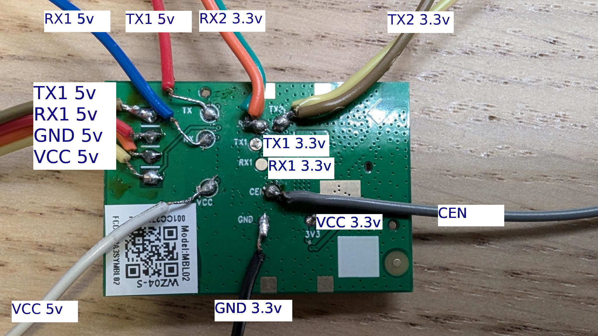

Let's add some wires to `RX1/TX1` and `RX2/TX2` just because we don't know exactly what these are used for. There's also the `GND` and the `CEN` (Chip Enable) that are going to be useful for rebooting the chip and getting to a flashing state. *(Please don't criticize my shoddy soldering job)*

We then see that we can connect two `RX1/TX1`, either via the one via the external Molex/Dupont [PHB-nAWB](https://www.hegxing.com.cn/wp-content/uploads/2021/10/WB2005PHB-SMT.pdf) connector, or directly on the PCB pads at the back. The difference between both being the voltage. The Dupont connector clearly states `5v` (see the 8051 MCU Board markings), while the back pads are directly routed to the chip in `3.3v`.

Then connecting the `RX1` -> `TX` , `TX1` -> `RX` and `GND` -> `GND` and selecting the 3.3v mode on our [FTDI232](https://www.amazon.com/DSD-TECH-SH-U09C5-Converter-Support/dp/B07WX2DSVB/), we can then use either OpenBeken's [BK7231GUIFlashTool](https://github.com/openshwprojects/BK7231GUIFlashTool) or Libretiny Flasher [ltchiptool](https://github.com/libretiny-eu/ltchiptool) to do the full chip dump (and a backup, twice).

The settings we can use for [**BK7231GUIFlashTool**](https://github.com/openshwprojects/BK7231GUIFlashTool):
- UART port / whatever your device says
- Select Chip Type: [BK7231M](https://www.elektroda.com/rtvforum/topic4032988.html) - Similar to BL2028N but with [0000... coeffs](#flashing-esphome)
- Select Baud Rate: 921600 (but you might have to try a few options there)
- Click on "Download Latest from the Web"
- Then click on "Do Firmware Backup (read) only".

The settings we can use for [**ltchiptool-GUI**](https://github.com/libretiny-eu/ltchiptool) are:
- Baud Rate: Auto
- Read Flash.
- Auto-Detect advanced parameters
- Chip Family: bk72xx.

For either, we need to start the flashing process and then put the chip in flashing mode by rebooting it grounding the `CEN` pad, i.e. connecting the `GND` to the `CEN` manually for about half a second when the program tells us to do it. 
Note that if we wanted to use the `5v` connector you need to ground the `GND` to `CEN` that is on the same `5v` connector.

The dumping proceeds as described by the tools and give you a `.bin` file. As a safety mechanisms let's do it with both tools and keep copies.

Good thing is both of these communities have great support group:

- [Elektroda Forums for OpenBeken](https://www.elektroda.com/rtvforum/forum390.html)
- [Discord for LibreTiny/ESPHome](https://discord.gg/SyGCB9Xwtf)

## Reversing the Webserver

Allright, we got them images 🎉 let's pop them in a reversing tool :)

Because we're cheap, we'll use [Ghidra](https://ghidra-sre.org/), that being said, there are two challenges we need to solve so that Ghidra knows what to do with that dump:

1. What is the base address (The address where the code logic we want it to reverse begins).
2. What kind of architecture are we looking at?
3. What is the endianess of that architecture?

For `2.` we can refer to [Libretyny's docs](https://docs.libretiny.eu/docs/platform/beken-72xx/) that mentions `Armv5TE` for `3.` we can just try both and see what Ghidra prefers (it's `little endian`).

For `1.`, it appears it depends on the board the chip is bundled on, and since we have no documentation, we'll have to asssume it's standard and see what works on generic [BK7231N](https://docs.libretiny.eu/boards/generic-bk7231n-qfn32-tuya/), the app image starts at `0x11000` so we could use just that?

Oh, that's not good:
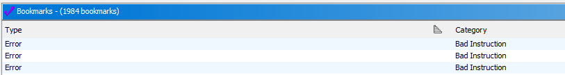


Arg, we forgot that there's one more challenge ⚠️: the dump is a raw memory dump, [with CRC16 every 32 bytes](https://docs.libretiny.eu/boards/generic-bk7231n-qfn32-tuya/#flash-memory-map) so we need to clear this before sending it to Ghidra.

So let's turn to `ltchiptool` to do the de-CRC work:

```bash
$ltchiptool soc bkpackager uncrc ./ltchiptool_bk72xx_2024-07-14_10-50-52_Dreo_Orig.bin ltchiptool_bk72xx_2024-07-14_10-50-52_Dreo_Orig.bin.decrc
```
Now that we have a De-CRC'd version, we can load it in Ghidra, remembering that:

- The first `0x11000` bytes are the bootloader.
- The base address is `0x10000`and was found with a bit of fiddling (confirmed later via UART).

Which brings us to a much more promising start with Ghidra:

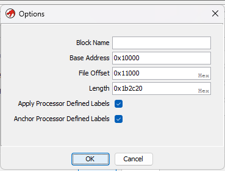

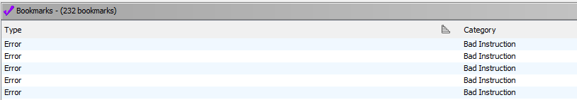

And after a few minutes of Ghidra doing it's magic, **ta-dah**, we have a "reversed" app.

🤔 So... Where do we go from here ?

Well, remember that `/wifilist` deadend? We could just search for strings, and see whether we find it...

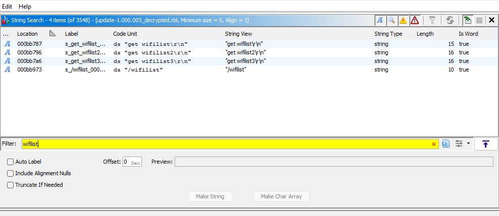

Exact match, that's great, let's click on that and see where it's being used at:

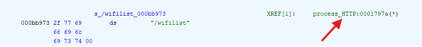

Of course, initially it wasn't named `process_HTTP` since symbols weren't kept in the compiled code, but after a few hours of figuring out what that function, and its subfunctions were doing, here's the decompiled version:

```C
void process_HTTP(undefined4 request_body,undefined4 param_2,undefined4 param_3)

{
  undefined *puVar1;
  int iVar2;
  undefined4 uVar3;
  
  console_log("buf=%s\r\n",request_body);
  FUN_0001bbdc();
  uVar3 = Request_Buffer;
  iVar2 = parse_POST_request(Request_Buffer,"POST_/model",0xb);
  if (iVar2 == 0) {
    console_log(model_update);
    *DAT_00017a10 = DAT_00017a0c;
    *DAT_00017a18 = DAT_00017a14;
    uVar3 = DAT_00017a1c;
  }
  else {
    iVar2 = parse_POST_request(uVar3,"POST_/mcu",9);
    if (iVar2 != 0) {
      iVar2 = parse_GET_request(request_body,"/a.rbl");
      if (iVar2 != 0) {
        FUN_00016b28(request_body,param_2,param_3);
        return;
      }
      iVar2 = parse_GET_request(request_body,"/model.html");
      if (iVar2 != 0) {
        FUN_00016bbc(request_body,param_2,param_3);
        return;
      }
      iVar2 = parse_GET_request(request_body,"/mcu.html");
      if (iVar2 != 0) {
        FUN_00016c3c(request_body,param_2,param_3);
        return;
      }
      console_log("test1\n");
      iVar2 = parse_GET_request(request_body,"/appinfoset");
      if (iVar2 != 0) {
        appinfoset(request_body,param_2,param_3);
        return;
      }
      console_log("test2\n");
      iVar2 = parse_GET_request(request_body,"/wifiinfoset");
      if (iVar2 != 0) {
        set_wifi_info(request_body,param_2,param_3);
        return;
      }
      console_log("test3\n");
      iVar2 = parse_GET_request(request_body,"/otaset");
      if (iVar2 != 0) {
        otaset(request_body,param_2,param_3);
        return;
      }
      console_log(test4\n);
      iVar2 = parse_GET_request(request_body,"/wifilist");
      if (iVar2 != 0) {
        console_log("get_wifilist");
        getWifiList(request_body,param_2,param_3);
        return;
      }
      console_log("zero\r\n");
      console_log("test5\n");
      iVar2 = parse_GET_request(request_body,"/devinfoget");
      if (iVar2 != 0) {
        getDeviceInfo(request_body,param_2,param_3);
        return;
      }
      iVar2 = parse_GET_request(request_body,"/otaLocalUp");
      if (iVar2 != 0) {
        otaupdate(request_body,param_2,param_3);
        return;
      }
      craft_response(Request_Buffer,0x800,DAT_00017a80,"text/plain",0);
      uVar3 = FUN_00057ea8(Request_Buffer);
      FUN_00031d3c(param_3,Request_Buffer,uVar3,0);
      return;
    }
    console_log("mcu_update");
    *DAT_00017a10 = DAT_00017a28;
    *DAT_00017a18 = DAT_00017a2c;
    uVar3 = DAT_00017a30;
  }
  puVar1 = DAT_00017a38;
  *DAT_00017a34 = uVar3;
  *puVar1 = 1;
  FUN_00017680(request_body,param_2,param_3);
  *puVar1 = 0;
  return;
}
```
Basically, it parses the HTTP request, and redirects based on the path, and only support those very specific paths.

Aything else goes to... You guessed it:

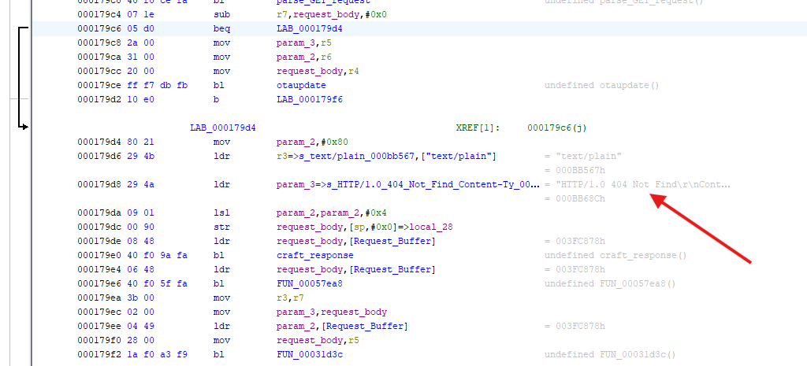


Oh yeah, those of you with fine eyes will have noticed that in some cases, the Webserver will respond...Twice, a 200, and then a 404 right after the `connection close`, ain't that neat?

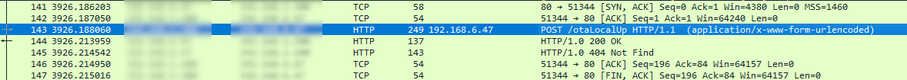

Anyways, we now know the entirety of the endpoints of that app, after going through a bunch, we find the one that is the most promising:
 `/model.html`:

 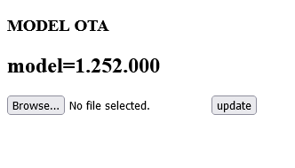


**This is what we're looking for !!** 🍾🥂🎊🎆🥳 

This is an OTA update webpage, that clearly points to that firmware version, that we surely can leverage to OTA update that app without having to open that fan, but how ?

## The Webserver endpoints

So now that we have a better understanding of what this code does, we can also fiddle with the other endpoints and guess what these are used for, looking at the behavior of the device:

| Endpoint    | Description |
| -------- | ------- |
| /a.rbl | A download test - Will send you a fake a.rbl file full of `0x00`.   |
| /appinfoset    | Unclear what this does. Takes `UserID`, `register`, `token`, `banding` as params in a JSON POST.    |
| /devinfoget    | Returns Device serial/info.    |
| /otaset    | Set OTA download? information. Takes `SSID`, `Key` and `otastr` as JSON parameter. (not clear what otastr should contain).    |
| /otaLocalUp    | Very probably used (with JSON input) in conjunction with  `/otaset` to trigger a local update download. Takes `otastr` as a JSON parameter.  |
| /wifilist    | We know this one already.    |
| /wifiinfoset  | Set the wireless connection information. Takes `SSID` and `Key` (Wireless password) as JSON parameters.  |

Most of these are meant to be called like so:

```bash
$curl -vvvvvvvvvvvv -d '{"Key":"<WIFI_PASSWORD>", "otastr":"<URL?>", "SSID":"<WIFI_SSID>"}' -X POST http://192.168.6.47/otaset
```

The mechanisms to use `otaset` in conjunction to `otaLocalUp` aren't exactly clear at the moment, but we can table this since we have a much easier way to OTA potentially, via `model.html`.

## Flashing ESPHome

Happy that we found a way to flash the chip software-wise, we still need to be able to validate what's happening when we do so.

Until now, we used `RX1/TX1` but these weren't giving us any feedback, there must be another console we can tap from, after all, we've seen from reversing the code that there are some debug messages in the Webserver `console_log("zero\r\n"); (...) console_log("test5\n");` they must be going somewhere...

Well, there are `RX2/TX2` pads exposed, on `3.3v`, let's connect to these with another UART adapter:

```console
BK7231n_1.0.8
CPSR:0x000000D3
R0:0x00800000
R1:0x00000000
R2:0x005AA000
R3:0x00000006
R4:0x00400001
R13:0x00401C1C
R14(LR):0x000033AC
ST:0x00000000
[I/FAL] Fal(V0.4.0)success
[I/OTA] RT-Thread OTA package(V0.2.4) initialize success.

go os_addr(0x10000)..........
prvHeapInit-start addr:0x412210, size:122352
[Flash]id:0xeb6015
[Flash]init over
sctrl_sta_ps_init
SDK Rev: 3.0.46_20220921_d9dce354c70f
[THD]app:[tcb]4137f0 [stack]4127e8-4137e8:4096:5
[THD]extended_app:[tcb]414060 [stack]413858-414058:2048:4
[THD]idle:[tcb]4144d0 [stack]4140c8-4144c8:1024:0
[THD]timer_thd:[tcb]415258 [stack]414650-415250:3072:2
OSK Rev: F-3.0.28
cset:0 0 0 0
bandgap_calm_in_efuse=0x34
[load]bandgap_calm=0x20->0x14,vddig=4->5
[FUNC]rwnxl_init
...
```
Nice, we're in!

Let's send some HTTP traffic, for good measure and confirm the function we were looking at was the console logger:

```console
ap_handle_timer
new accept fd:5
buf=GET / HTTP/1.1
Host: 192.168.0.1
User-Agent: Mozilla/5.0 (X11; Ubuntu; Linux x86_64; rv:128.0) Gecko/20100101 Firefox/128.0
Accept: text/html,application/xhtml+xml,application/xml;q=0.9,image/avif,image/webp,image/png,image/svg+xml,*/*;q=0.8
Accept-Language: en-CA,en-US;q=0.7,en;q=0.3
Accept-Encoding: gzip, deflate
DNT: 1
Connection: keep-alive
Upgrade-Insecure-Requests: 1
Sec-GPC: 1
Priority: u=0, i


test1
test1
test2
test3
test4
zero
test5
not client left, close spidma
new accept fd:5
```

Aaah, don't you love it when devs leave debug messages in their code?

So now we can track the OTA update mechanism from the terminal, we still need to understand a few things:

1. Is the chip's eFuse going to allow us to do the OTA update (see BL2028N specsheet)?
2. What are the OTA Keys we need to use?
3. What are the coefficients (code encryption keys) should we need them?
4. What are the offsets for the partition table (⚠️important not to brick our device)?

We'll have to do a bit of binary exploration to get this info.

### Finding the keys

- We have a dump of the bootloader code.
- We know that even if the eFuse has code protections via coeffs built-in, the bootloader has the key to decrypt and install OTA updates anyways. And this key is quite often `0x123456789ABCDEF`.
- We just need to find the keys that are used in our chip to build a valid OTA image that the current bootloader will accept.

Let's dig into the binary file using a hex editor:
 
 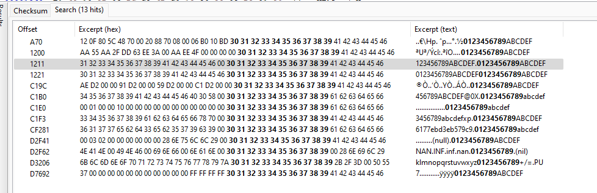

Looks like we're lucky.

Also, the IV is right there (`01 23 45 67 89 AB CD EF`), and the coeffs are right before the second match here in case we need them `78 56 34 12 AA 55 AA 2F DD 63 EE 3A 00 AA EE 4F`.

 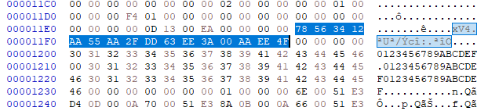

 | Element    | Value |
| -------- | ------- |
| OTA Key | 0x0123456789ABCDEF0123456789ABCDEF  |
| OTA IV | 0x0123456789ABCDEF  |
| Coeffs | 0x78563412AA55AA2FDD63EE3A00AAEE4F  |

### Finding the partition offsets

We just need to find the offets to set the right partitions. Of particular interest are:

- **The download (OTA) partition**: this is used to save the OTA before doing the update. If this partition is wrong, then the bootloader won't be able to do OTA and you'll be locked out of your device (at least w/o a UART connection). Ask me how I know 😅
- **The calibration partition**: this partition is used to configure the way the wifi/BLE behaves. With a wrong calibration offset, the wireless performance will be either degraded or non-functional. Ask me how I know 😅

 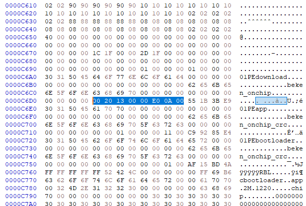

 Looking at the bootloader's partition table, with help from my friend [kuba2k2](https://github.com/kuba2k2) we can infer that the offsets are such:

 | Partition    | Offset |  Length |
| -------- | ------- | ------- |
| download | 0x132000  | 0xAE000  |

Now, we need to find the **calibration partition** offset.

For this, we'll refer to the original dump we did using `ltchiptool` or `bk7231flasher`, well look for the `TLV` storage, and we know it must be 0x00 aligned (i.e. the first chars on the left in our hex editor). Also, it has to be somewhat similar to the layout described for the generic [Bk7231N chip](https://docs.libretiny.eu/boards/generic-bk7231n-qfn32-tuya/#flash-memory-map).

Searching for all occurences of `TLV` in our dump image, we quickly find this one:
 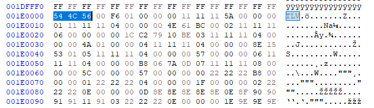

Pretty similar to the generic one `Calibration 	0x1E0000 	4 KiB / 0x1000 	0x1E1000` although the length is much shorter (0x200), so we'll use that.

 | Partition    | Offset |  Length |
| -------- | ------- | ------- |
| download | 0x132000  | 0xAE000  |
| calibration | 0x1E0000  | 0x200 (approx) |


In theory we now have everything we need to build a custom ESPHome image:
- The coeffs.
- The OTA Key.
- The OTA IV.
- The OTA partition offset.
- The calibration partition offset.

That being said, if we flash this image, what will it do with the fan? Well, not much, since we still need to control the 8051 MCU via UART to have it spin up/down/rotate the fan...

There's still a piece of the puzzle that is missing, what is that protocol?

## Reversing the UART Protocol

Thankfully, we've been blessed by the devs, as we can clearly see traffic being exchanged on `TX2/RX2`, plus most of the time we can see the breakdown of values (although no "bitmap"):

```console
uartCmdLen=12
send: len=12,buf=aa 0b ff 00 00 00 00 00 00 07 00 ef 
sendend 
recv: len=43,buf=aa 2a fa 00 00 00 00 00 00 07 30 30 30 30 46 41 32 31 31 35 36 30 36 36 36 36 36 31 36 36 31 33 31 31 30 30 30 37 30 30 30 30 67 
get ack1
handle_sn
uartCmdLen=11
send: len=11,buf=aa 0a fa 00 00 00 00 00 00 03 f9 
sendend 
recv: len=40,buf=aa 27 fa 00 00 00 00 00 00 03 00 00 08 00 03 01 00 00 20 02 00 00 00 51 00 00 00 00 00 40 00 00 01 02 00 00 00 00 00 1a 
get ack1
spinSwitch=0
airDrySwitch=0
tempWindSwitch=0
displayOnOff=1
timeoff=0
timingOffHour=0
timingOffMinute=0
timingOnMinuteEx=0
timeron=0
timingOnHour=0
timingOnMinute=0
timingOnMinuteEx=0
temperatureFeedback=81
temperatureFeedback=81
handle_DataPointNotify begin
tmptime=0,thists=1720566290
lasttmptime=0,lastts=1720565236
tmptime=0,thists=1720566290
lasttmptime=0,lastts=1720565236
id=01,type=01,change=0,bool=1
id=0d,type=01,change=0,bool=1
id=03,type=04,change=0,enum=1
id=04,type=04,change=0,enum=1
id=05,type=01,change=0,bool=0
id=07,type=02,change=0,int=0
id=06,type=02,change=0,int=0
id=08,type=01,change=0,bool=0
id=0c,type=04,change=0,enum=60
id=09,type=04,change=0,enum=0
id=0b,type=02,change=0,int=81
```

So after a lot of testing for every single feature, inspecting the UART traffic and looking at the output, we can come to that byte mapping for **changing fan settings** (send part):

```console
 p->dpid=4
gear,2
send: len=31,buf=aa 1e fa 00 00 00 00 00 00 02 00 00 00 00 03 02 00 00 20 02 00 00 00 53 00 00 00 00 00 00 6c 
sendend 
recv: len=40,buf=aa 27 fa 00 00 00 00 00 00 02 00 00 08 00 03 02 00 00 20 02 00 00 00 53 00 00 00 00 00 40 00 00 01 02 00 00 00 00 00 18 
get ack1
```
### Change Fan Settings Byte Map


 | Byte Index    | Description |
| -------- | ------- |
| 01 | First byte, always `0xAA`  |
| 02 | Length of bytestream, excluding the first byte but including the last.  |
| 03 | Command type byte, seems to be `0xFA` for changing a setting, `0xFF` for handshakes/reading info from the fan. |
| 04 - 09 | Always `0x00`  |
| 10 | Most of the time `0x02` for changing a setting. Sometimes `0x04` or `0x03` for handshakes/reading info. |
| 11 - 12 | Always `0x00`  |
| 13 | Beeper Mode:<br>`0x40` = Beeper On<br>`0x80` = Beeper OFF |
| 14 | Always `0x00` |
| 15 | Fan Mode:<br>`0x02` = OFF<br>`0x03` = Normal<br>`0x05` = Natural<br>`0x07` = Sleep<br>`0x1b` = Auto |
| 16 | Fan Speed: From `0x01` to `0xC` (I have not tested more than `0xC` as it might break the fan)  |
| 17 - 18 | Always `0x00`  |
| 18| Oscillation Angle:<br>`0x00` = OFF <br> `0x11` = 30 Degrees<br>`0x21` = 60 Degrees<br>`0x31` = 90 Degrees<br>`0x41` = 120 Degrees<br>(It actually appears only the 1st nibble is used for that, so `0x10`, `0x20`, `0x30`, `0x40` might work also) |
| 19 | Always `0x02` |
| 20 | Timer Hours On (in conjunction with byte #24):<br> `0xc0` = Cancel Timer<br> `0xa1` = 1st Nibble "hours ON", 2nd Nibble "How many Hours"<br>Ex: (this still has to be further investigated) `ab xx xx xx 70` = 11h57min, `af xx xx xx 80` = 15h58 min. |
| 21 - 22 | Always `0x00`   |
| 23 | Temperature in F: `0x4e` =  `78F` (Not sure why this is sent in commands, maybe calibration?)<br>It is also sent back from the MCU so we'll eventually need to read this.|
| 24 | Timer Minutes On (in conjunction with byte #20):<br> `0x80` = 8 minutes<br> `0x10`= 1 minute|
| 25 - 28 | Always `0x00`   |
| 29 | Adaptative Display:<br>`0x40` = Adaptative Display On<br>`0x80` = Adaptative Display OFF  |
| 30 | [Checksum](#checksum) |

There also exist other commands to get settings from the fan/MCU:

**BL2028N -> 8051 MCU**

Get Fan Settings/Handshake:
`aa 0a fa 00 00 00 00 00 00 03 f9`

Get Fan Serial:
`aa 0b ff 00 00 00 00 00 00 07 00 ef`

Make the pairing led flash:
`aa 1e fa 00 00 00 00 00 00 64 00 00 00 00 03 03 00 00 00 00 00 00 00 00 00 00 00 00 00 00`

**8051 MCU -> BL2028N**

Set the BL2028N in pairing mode:
`aa 1f fa 00 00 00 00 00 00 64 00 00 00 00 00 01 00 00 00 00 00 00 00 00 00 00 00 00 00 00 00`

And the MCU sends us some messages from time to time, that I haven't yet taken a deep look at:
`AA 1E FA 00 00 00 00 00 00 61 00 00 00 00 00 00 00 00 00 00 00 00 00 00 00 00 00 00 00 00 87`

`AA 1E FA 00 00 00 00 00 00 63 00 00 00 00 00 00 00 00 00 00 00 00 00 00 00 00 00 00 00 00 85`

That's great, we can most definitely replay the commands that are sent, but in order to be able to change a single setting, we absolutely need to understand the **checksum**, otherwise the MCU just refuses our commands.

### Checksum

This took way, way too long to figure out, mostly because it's 100% custom. It didn't help that ChatGPT regularly gave me wrong results for additions/XOR without implementing it in Python (TIL).

There are very little, if no reference online, and although the devs could have used standards like `CRC-8` (even if about 30 different `CRC-8` exist), or even just `CRC-16` like the chip memory, which is probably done super fast in hardware (and supported by the MCU as well per the specsheet), but no they had to re-implement a custom algorithm, which is as follows:

1. Ignore the first byte (`0xAA`).
2. Start with the value of the second byte (The length).
3. Substract every single byte.
4. Substract 2x the length.
5. Modulo 256 (`0x100`).

Also, shoutout to [CyberChef](https://gchq.github.io/CyberChef/) being the MVP there 👩‍🍳

## Putting this all together
This is where the story ends, we have all the pieces of the puzzle to implement a custom ESPHome integration by leveraging:

- The offsets and keys
- The UART protocol
- The checksum algorithm

We can now put the [Dreo_DR-HTF004S.yaml](./code/Dreo_DR-HTF004S.yaml) file together and build the ESPHome images that will allow us to do the **initial OTA** via the `/model.html` Web page, and finally de-cloudify our fan 👏

Since we're still connected to `RX2/TX2` we can see the OTA process taking place fully:

```console
new accept fd:3
buf=POST /model.html HTTP/1.1
Host: 192.168.6.44
User-Agent: Mozilla/5.0 (Windows NT 10.0; Win64; x64; rv:128.0) Gecko/20100101 Firefox/128.0
Accept: text/html,application/xhtml+xml,application/xml;q=0.9,image/avif,image/webp,image/png,image/svg+xml,*/*;q=0.8
Accept-Language: en-US,en;q=0.5
Accept-Encoding: gzip, deflate
Content-Type: multipart/form-data; boundary=---------------------------864300603238788249392728592
Content-Length: 517673
Origin: http://192.168.6.47
DNT: 1
Connection: keep-alive
Referer: http://192.168.6.47/model.html
Upgrade-Insecure-Requests: 1
Sec-GPC: 1
Priority: u=0, i

-----------------------------864300603238788249392728592
Content-Disposition: form-data; name="firmware"; filename="image_bk7231n_app.ota.rbl"
Content-Type: application/octet-stream

RBL
model update
gethdata
len=1460,headlen=613
bodylen11=517673,lewaiteData testmcuflag break
txbuf badtime=0,badtime2=0
pub_publish=$aws/things/1453300621256003586-cc8dec1402944b18:001:0000000000s/shadow/update
data={
	"state":	{
		"reported":	{
			"connected":	false
		}
	},
	"clientToken":	"D:I:00000"
}
sendPacket,length=174
MQTTPublish wait=60000
ft=847
bodylen11=517673,left=847
ret=187
bodylen2=517486,left=660
bodylen2=517486,left=660
bodylen3=517486,left=660
--write status reg:0,2--
bodylen4=517486,left=660
max=517120,left=660
erase_addr:132000 
erase_addr:133000 
sendPacket,length=2
to disconnect
my_socket = 2
err n->my_socket = 2
err close socket...
MQTTDisconnect my_socket = -1...startMqtt
mqttDataCreate2,416e10
waiteData end
sendNetChangeStatus netStatus=16
waitToRespose
waitToRespose1
to pair ok=====,56647
NetChange,16,bleid=0
bleconnect 0
erase_addr:134000 
erase_addr:135000 
erase_addr:136000 

(...)

erase_addr:1b0000 
max=517120,left=660
len=0,left=366
readdataend
len21=366,left=366
tallen=304
flashlen=517424
store_data end ret=0
rcv_buf:HTTP/1.0 200 OK
Content-Type: text/plain
Connection: close
Content-Length: 0


--write status reg:4004,2--
mcu_updateEndSet begin
got to check
check error 4,MEDIAVERHEAD=10FA000100171560000
mcu_updateEndSet begin error
bk_reboot
wdt reboot
BK7231n_1.0.8
CPSR:0x000000D3
R0:0x00800000
R1:0x00000000
R2:0x005AA000
R3:0x00000006
R4:0x00400001
R13:0x00401C1C
R14(LR):0x000033AC
ST:0x00010001
[I/FAL] Fal(V0.4.0)success
[I/OTA] RT-Thread OTA package(V0.2.4) initialize success.
[I/OTA] OTA firmware(app) upgrade(1.00->24.07.13-bk7231n) startup.
[I/OTA] The partition 'app' is erasing.
###############BBBBBBBBBBB#############[I/OTA] The partition 'app' erase success.
[I/OTA] OTA Write: [>                                                                                                   ] 0%
[I/OTA] 

(...)

[I/OTA] OTA Write: [=========================>                                                                          ] 25%

(...)

[I/OTA]
[I/OTA] OTA Write: [====================================================================================================] 100%
[E/OTA] (ota_erase_dl_rbl:24) ota_erase_dl_rbl

[E/OTA] (ota_erase_dl_rbl:34) ota_erase_dl_rbl erase:132000

go os_addr(0x10000)..........
I [      0.000] LibreTiny v1.5.1 on generic-bk7231n-qfn32-tuya, compiled at Jul 13 2024 19:11:46, GCC 10.3.1 (-O1)
[C][safe_mode:079]: There have been 0 suspected unsuccessful boot attempts
[D][lt.preferences:104]: Saving 1 preferences to flash...
[D][lt.preferences:132]: Saving 1 preferences to flash: 0 cached, 1 written, 0 failed
[I][app:029]: Running through setup()...
[C][wifi:047]: Setting up WiFi...
[C][wifi:060]: Starting WiFi...
[C][wifi:061]:   Local MAC: [REDACTED]
[D][wifi:481]: Starting scan...
[W][component:157]: Component wifi set Warning flag: scanning for networks
```

# The Howto

⚠️🚨 **[Read this](#disclaimer)** then come back here.

## Create your ESPHome environment
- You can simply follow the instructions from [LibreTiny](https://docs.libretiny.eu/docs/projects/esphome/).
- If you run HA, you should consider using the [ESPHome Add-on](https://esphome.io/guides/getting_started_hassio.html) doing it in HA with the add-on.

## Get the Dreo YAML file
- Use the [Dreo_DR-HTF004S.yaml](/code/Dreo_DR-HTF004S.yaml) file to configure your own parameters:
    
    - [`wifi:`](https://esphome.io/components/wifi.html) block (including the `manual_ip:`, `ap:` block)
    - [`web_server:`](https://esphome.io/components/web_server.html) block
    - [`api:`](https://esphome.io/components/api.html) block
    - [`ota:`](https://esphome.io/components/ota/esphome.html) block

Note that the YAML file makes use of C++ Lambdas to support UART communications with the MCU and tries to restore the settings for when the fan was turned off.

This is **not** a bi-directional integration where we re-read the MCU's settings. For now this also means that the temperature reading isn't supported.

Also, the timer function isn't supported, HA has a much, much more powerful schedule management than the built-in timer.

## Build the ESPHome image

You have two choices depending on what you did prior:

Use your HA ESPHome integration to do so via `Install -> Manual download -> Beken Application Image` and download the `.rbl` OTA file (encrypted with the right keys)
- Call `esphome build Dreo_DR-HTF004S.yaml` command to generate the `.rbl` file that should be present after the build completes without errors in `/esphome/.esphome/build/Dreo_DR-HTF004S/.pioenvs/Dreo_DR-HTF004S/image_bk7231n_app.ota.rbl`

If you use the second route, you can even validate the pre-encryption OTA file that is going to be at `/esphome/.esphome/build/Dreo_DR-HTF004S/.pioenvs/Dreo_DR-HTF004S/image_bk7231n_app.0x011000.rbl` with a hex editor and look at its partition table (search for the magic ASCII `01PE`)

## Upload your OTA Update

Once you have your encrypted and gzipped `.rbl` handy (the encryption and zipping are done automatically by ESPHome), you can:
1. Put the fan back into pairing mode (hold the "swivel" button for 5s).
2. It should expose an AP named `Dreo...` (you can find the exact name in the original firmware if you have a copy of it, in a hex editor, search for `HTFfirm` ASCII string)
3. Connect to the AP and let it provide you with an address. It should take an IP in the `192.168.0.x` subnet.
4. Now that you're connected, just validate the device information via the `/devinfoget` command and ensure you have the right fan, this is the last check before you're going to flash your device.
5. Navigate to `http://192.168.0.x/model.html`
6. Upload your `.rbl` via model.html and do a little 🙏
   - If the image is recognized (encrypted/gzipped correctly) the page will take some time to load/provide a response, and the device will actually reboot in ESPHome with the config you provided.
   - If the page instantaneously breaks like a `404/connection interrupted` it means the image wasn't recognized for some reason.

The device should now reboot, and connect to your wifi where you pointed it in your `.yaml` file. There's also the backup `ap:` config in case it think it broke, and you should be able to connect to this AP from ESPHome if something went wrong, to fix it.

Congrats, you made it! 🎉

If you didn't, and can't find the ESPHome backup AP, or something got awfully wrong, well, [UART it is, my friend.](#dumping-that-firmware)

# Where do we go from here / What's left to tackle
If you're skilled and motivated, feel free to fork this repo and tackle this list of challenges:

- [ ] Finish the bi-directionnal integration and read the config from the UART traffic sent by the MCU (As well as the temperature).
- [ ] Build a real ESPHome component in C++ instead of the Lambdas that I used in the `.yaml` file.
- [ ] Add support for other fans.
- [ ] Add support for the fan timer.
- [ ] Re-implement the "long press on oscillate" to reset the wifi.

# FAQ
## When is XXXXX going to be supported?
I don't plan on maintaining this other than for my direct immediate needs. Unfortunately I am quite busy and run multiple projects in parallel, and would be quite happy if someone else with more advanced ESPHome knowledge would fork this and add more features. I shared as much information as possible in that repo so that others could take over should they feel the desire to do so.

## It doesn't work on my fan / I Bricked it / etc.
Unfortunately, as stated in the disclaimer, this guide only made available for informational purposes, and although the approach might work with other Dreo fans, or even different models of the same fan, it is not an assumption one can make without risking to brick your fan.

Dreo might have used a completely different application/firmware, a different MCU with a different protocol.
The only way to truly know this is to dump your firmware using UART, validate it's the same version and/or fork this repo to add your modifications.

## Does this work with other Dreo Pilot Max (DBTF04S, DTTF04S)?
Unfortunately, as stated in the disclaimer, this guide only made available for informational purposes, and although the approach might work with other Dreo fans, or even different models of the same fan, it is not an assumption one can make without risking to brick your fan.

Dreo might have used a completely different application/firmware, a different MCU with a different protocol.
The only way to truly know this is to dump your firmware using UART, validate it's the same version and/or fork this repo to add your modifications.

## Are you going to maintain that ESPHome module?
I don't plan on maintaining this other than for my direct immediate needs. Unfortunately I am quite busy and run multiple projects in parallel, and would be quite happy if someone else with more advanced ESPHome knowledge would fork this and add more features. I shared as much information as possible in that repo so that others could take over should they feel the desire to do so.

## Why didn't you implement MQTTS support for the control of the device?
See [there](#when-is-xxxxx-going-to-be-supported)
